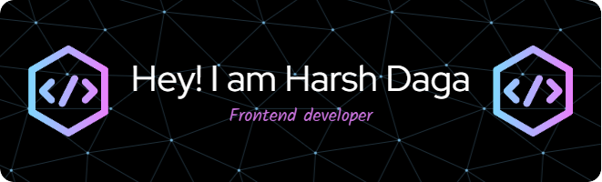

   

 

  

I am persuing Information Science and Engineering at <a href="https://www.bmsce.ac.in/" target="_blank"> BMSCE, Basavanagaudi</a>. I'm a self taught developer who loves learning about new technologies. I am currently learning Ruby on Rails and Devops. Apart from development, I love reading Books, watching Movies and learning new things. I'm a driven hard-working student, and what makes me who I am is my eagerness to learn new things.

 

 
---

# 💻 Tech Stack:
                  

## 🌐 Socials:
  

# 📊 GitHub Stats:

 ## 💰 You can help me by Donating
    

  
