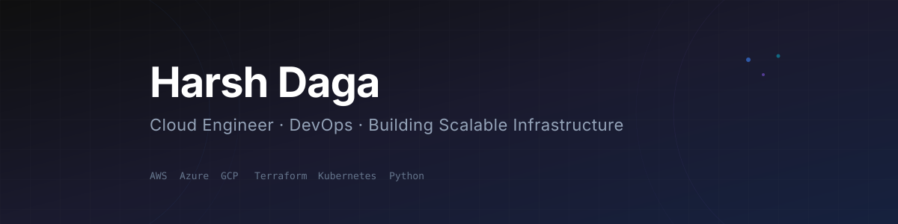

# Harsh Daga

Cloud engineer. I design and operate multi-cloud infrastructure for a CPaaS platform running across 10+ regions, currently handling 1M+ calls/day at 99.9% uptime. Most of my day-to-day sits at the intersection of Kubernetes, Terraform, and the kind of observability that tells you what broke before a customer does.

Outside of that, I build systems-flavored side projects — mostly things that let me apply infra ideas (caching, compression, framing, congestion control) to problems that don't usually get that treatment.

---

## How I build

- **Boring tech over clever tech.** Reliability compounds; cleverness usually doesn't.
- **Fail loud, fail cheap.** Silent degradation is worse than a crash.
- **Reproducible by default.** If it can't be rebuilt from source, it's not done.
- **Local-first, no lock-in.** Own your data and your escape hatch.
- **Do one thing.** Scope creep is how infrastructure becomes fragile.

---

## Projects

### [Cairn](https://github.com/Harsh-Daga/Cairn)
**Problem** — coding agents (Claude Code, Cursor, etc.) burn tokens invisibly: re-read files, redundant context, no caching between runs.
**Approach** — a local-first build system for LLM computation over a corpus of files, structurally closer to Make or Bazel than to an agent framework. Every prompt is a DAG node; nodes are content-addressed and cached, so a node only re-runs when its actual inputs change.
**Result** — a ledger of every session that shows exactly where cost is going, plus concrete optimization suggestions instead of a vague "reduce tokens" warning.

### [Lattice](https://github.com/Harsh-Daga/Lattice)
**Problem** — LLM API calls are expensive and provider-specific, with no shared transport-layer discipline.
**Approach** — a transport and efficiency layer between applications and 17 LLM providers: prompt compression, response caching, concurrency control. Built on token-aware congestion control, a custom binary framing protocol, and delta encoding for multi-turn sessions.
**Result** — ~40% average prompt compression, provider-agnostic.

### [IncidentScribe](https://github.com/Harsh-Daga/Incident-Scribe)
**Problem** — incident response has a lot of low-judgment, high-toil work: detection, triage, writing it all up afterward.
**Approach** — multi-agent orchestration that handles detection, triage, and postmortem drafting end to end.
**Result** — the 2am part of on-call gets automated; a human is paged for the part that actually needs judgment.

### [Catalyst Detector](https://github.com/Harsh-Daga/Catalyst-Detector)
**Problem** — market-moving news is buried in noisy filings and headlines.
**Approach** — multi-LLM pipeline built to extract catalyst-relevant signal from that noise.
**Result** — a working side project into financial infra, from an infra background rather than a finance one.

---

## Stack

```
infra          kubernetes · terraform · argocd
cloud          aws · azure · gcp
observability  prometheus · grafana · elk
languages      python · go · bash
```

---

## Latest from Medium
<!--LATEST_POST_START-->
<!--LATEST_POST_END-->

---

## Links

| | |
|---|---|
| Portfolio | [harshdaga.vercel.app](https://harshdaga.vercel.app) |
| LinkedIn | [linkedin.com/in/harsh-daga2003](https://linkedin.com/in/harsh-daga2003) |
| Writing | [medium.com/@harshdaga18](https://medium.com/@harshdaga18) |
| X | [x.com/harshsdaga](https://x.com/harshsdaga) |
| Resume | [harshdaga.vercel.app/resume](https://harshdaga.vercel.app/resume) |
| Email | hs108699@gmail.com |
