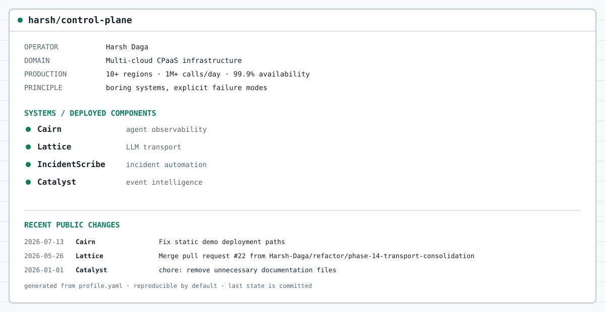

<!-- Generated by generate.py from profile.yaml. Do not edit by hand. -->

<picture>
  <source media="(prefers-color-scheme: dark)" srcset="./assets/control-plane-dark.svg">
  <source media="(prefers-color-scheme: light)" srcset="./assets/control-plane-light.svg">
  
</picture>

# Harsh Daga

I operate distributed infrastructure and build systems that explain their own behavior.

At work, that means Multi-cloud CPaaS infrastructure across 10+ regions · 1M+ calls/day · 99.9% availability.

Outside work, I apply infrastructure ideas—observability, caching, framing, congestion control, reconciliation, and failure isolation—to systems that do not normally receive infrastructure-level discipline.

> This is not a manually maintained profile page. It is a generated view of declarative engineering state.

## Production scope

```text
OPERATOR       Harsh Daga
ROLE           Cloud Infrastructure Engineer
DOMAIN         Multi-cloud CPaaS infrastructure
PRODUCTION     10+ regions · 1M+ calls/day · 99.9% availability
PRINCIPLE      boring systems, explicit failure modes
```

## Systems topology

```text
SYSTEM MODEL
├── provision     Terraform · Terragrunt · Ansible
├── reconcile     Kubernetes · Helm · Argo CD
├── observe       Prometheus · Grafana · ELK · Thanos
├── communicate   SIP · RTP · distributed networking
└── experiment    agent observability · LLM transport · incident automation
```

## Deployed components

### SYSTEM: [cairn](https://github.com/Harsh-Daga/Cairn)

```text
class        agent observability
objective    make agent behavior explainable
mechanism    traces → fingerprints → outcomes → improvement
properties   local-first · measurable · reproducible
state        active
```

### SYSTEM: [lattice](https://github.com/Harsh-Daga/Lattice)

```text
class        LLM transport
objective    reduce provider and token inefficiency
mechanism    compression → cache → framing → flow control
properties   provider-neutral · protocol-oriented
state        active
```

### SYSTEM: [incidentscribe](https://github.com/Harsh-Daga/Incident-Scribe)

```text
class        incident automation
objective    remove low-judgment on-call toil
mechanism    detection → triage → timeline → postmortem
properties   human escalation · explicit handoffs
state        active
```

### SYSTEM: [catalyst](https://github.com/Harsh-Daga/Catalyst-Detector)

```text
class        event intelligence
objective    surface signal from noisy public events
mechanism    ingest → extract → evaluate → alert
properties   evidence-oriented · infrastructure-minded
state        active
```

## Recent public changes

- `2026-07-14`  **[Cairn](https://github.com/Harsh-Daga/Cairn/commit/c46003facb2305e7bbb84a4292fadb039fbe8ff8)** — Release Cairn 1.1.1 after PyPI filename rejection (#35)
- `2026-05-26`  **[Lattice](https://github.com/Harsh-Daga/Lattice/commit/8bc80f1690d41ac7ad3309b138d403bb12c1f44d)** — Merge pull request #22 from Harsh-Daga/refactor/phase-14-transport-consolidation
- `2026-01-01`  **[Catalyst](https://github.com/Harsh-Daga/Catalyst-Detector/commit/ea7b9a98d45ab3631d798d5ec87a6a34e3bde439)** — chore: remove unnecessary documentation files
- `2025-12-14`  **[IncidentScribe](https://github.com/Harsh-Daga/Incident-Scribe/commit/874cb81693f554f29e553ccdad26b99586a6f95e)** — Merge pull request #6 from Harsh-Daga/doc-update

_Change feed is reconciled from public repositories; the last committed state remains visible when the API is unavailable._

## Operating principles

- boring technology
- visible failure
- reproducible systems
- local-first design
- narrow responsibility

## Operator log — 2026 Q3

- Operating regional telephony infrastructure across AWS, Azure, and GCP.
- Building causal observability for coding agents through Cairn.
- Exploring protocol-level efficiency for LLM traffic through Lattice.
- Writing down failure modes usually discovered only during incidents.

## Latest writing

- [Why Serving 100 Users Is Cheaper Than Serving 1](https://medium.com/@harshdaga18/why-serving-100-users-is-cheaper-than-serving-1-37b51b1dbbdb?source=rss-b04833cbf645------2)

## Contact

[Portfolio](https://harshdaga.vercel.app) · [LinkedIn](https://linkedin.com/in/harsh-daga2003) · [Writing](https://medium.com/@harshdaga18) · [X](https://x.com/harshsdaga) · [Résumé](https://harshdaga.vercel.app/resume) · [Email](mailto:hs108699@gmail.com)
